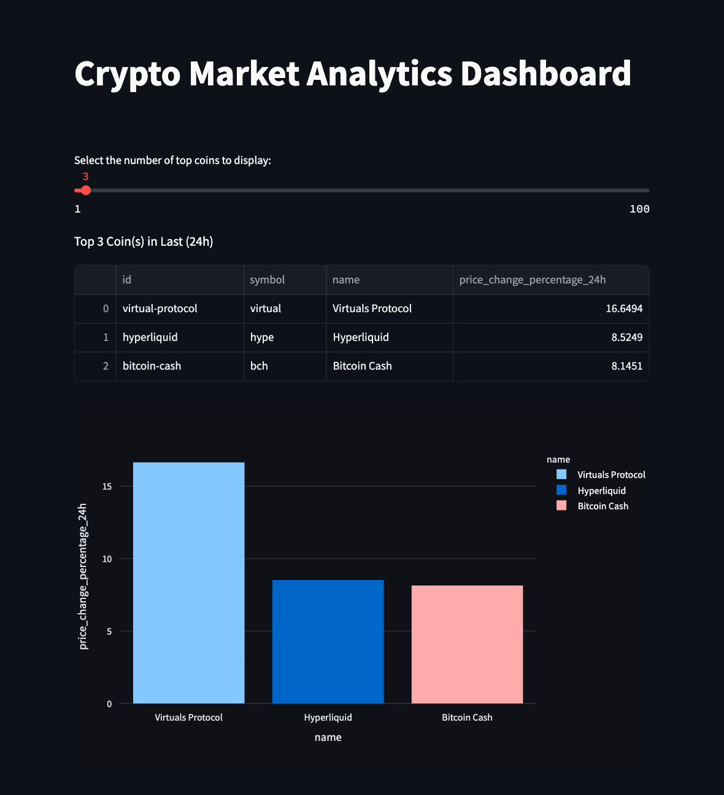

# Spark Crypto Dashboard

## Overview

This repository fetches cryptocurrency data from [CoinGecko](https://www.coingecko.com) and analyzes it using Apache Spark. Currently, the application identifies the coins with the highest `price_change_percentage_24h` and visualizes the data in a Streamlit chart.

## How to Run

To start the application, follow these steps:

1. Run the following command:
    ```bash
    make up
    ```

2. Once the application is running, access it by navigating to [http://localhost:8501](http://localhost:8501) in your web browser.

### Prerequisites

Ensure you have the following installed on your system:
- Docker
- Make

